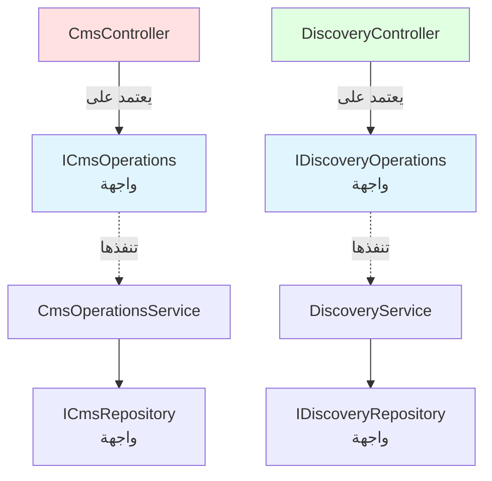
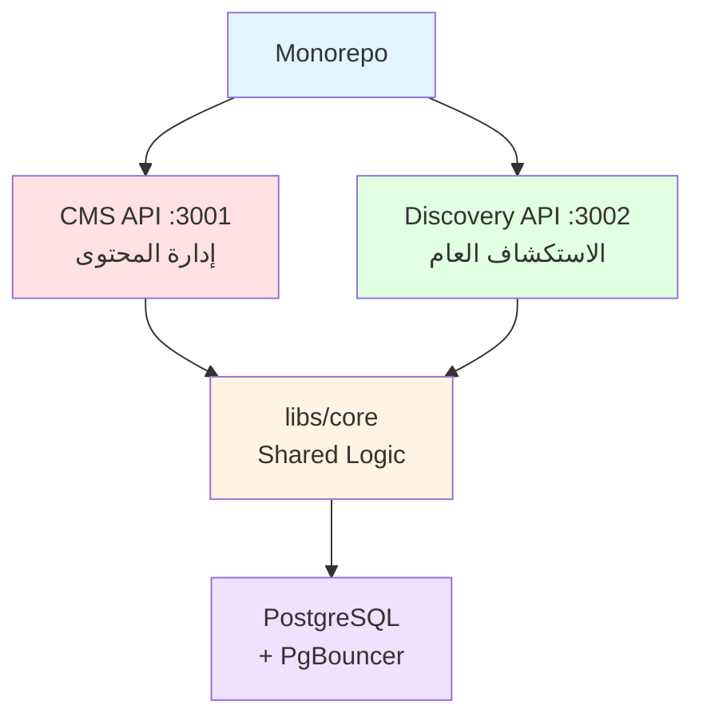

# نظام ثمانية الإعلامي | Thamanya Media Backend

نظام متكامل لإدارة واستكشاف المحتوى الإعلامي مصمم للتعامل مع **10 ملايين مستخدم في الساعة**.

---

## 🎯 معايير التقييم - Evaluation Criteria

### ✅ 1. نقاط الوصول الموثقة (API Endpoints)

**14 endpoint** موثقة بالكامل تخدم مطوري الواجهة الأمامية:

| API | Endpoints | الغرض |
|-----|-----------|-------|
| **CMS** (Port 3001) | 8 endpoints | إدارة المحتوى (admin) |
| **Discovery** (Port 3002) | 6 endpoints | الاستكشاف العام (public) |

📖 **التوثيق الكامل:** [API_SPECIFICATION.md](./API_SPECIFICATION.md)

### ✅ 2. التقنيات المستخدمة (Technology Stack)

```
✅ NestJS 10.3       - الإطار الرئيسي
✅ TypeScript 5.3    - لغة البرمجة
✅ PostgreSQL 15     - قاعدة البيانات
✅ PgBouncer         - Connection Pooling
```

### ✅ 3. مبادئ SOLID & Low Coupling



**التطبيق:**
- ✅ **Single Responsibility:** كل service له مسؤولية واحدة
- ✅ **Interface Segregation:** Controllers تعتمد على واجهات محددة
- ✅ **Dependency Inversion:** التبعية على التجريدات، ليس التطبيقات
- ✅ **Low Coupling:** Repository pattern + Strategy pattern
- ✅ **Module Boundaries:** Monorepo مع libs/core مشتركة
## 🚀 التشغيل السريع (3 خطوات)

### المتطلبات
- Node.js 18+
- Docker & Docker Compose
- YouTube API Key (اختياري للاختبار الكامل)

### الخطوات

```bash
# 1. تثبيت التبعيات
npm install && npm run build

# 2. تشغيل قاعدة البيانات
npm run docker:up

# 3. تشغيل التطبيقات
npm run start:cms        # Terminal 1 - Port 3001
npm run start:discovery  # Terminal 2 - Port 3002
```

## 📡 أمثلة API

### مثال 1: البحث في YouTube واستيراد برنامج

```bash
# البحث في YouTube
curl -X POST http://localhost:3001/admin/programs/integrations/search \
  -H "Content-Type: application/json" \
  -d '{"provider":"YOUTUBE","q":"tutorial","limit":5}'

# استيراد برنامج
curl -X POST http://localhost:3001/admin/programs/import \
  -H "Content-Type: application/json" \
  -d '{"provider":"YOUTUBE","externalId":"VIDEO_ID"}'
```

### مثال 2: تحديث ونشر برنامج

```bash
# تحديث البيانات الوصفية
curl -X PATCH http://localhost:3001/admin/programs/{ID} \
  -H "Content-Type: application/json" \
  -d '{"title":"عنوان جديد","language":"ar-SA"}'

# نشر البرنامج
curl -X PUT http://localhost:3001/admin/programs/{ID}/publish \
  -H "Content-Type: application/json" \
  -d '{}'
```

### مثال 3: البحث واستكشاف المحتوى

```bash
# البحث النصي الكامل
curl "http://localhost:3002/programs/search?q=تقنية&lang=ar-SA&limit=10"

# الصفحة الرئيسية مع الترتيب
curl "http://localhost:3002/programs?page=1&sort=newest&limit=20"

# الحصول على برامج مشابهة
curl "http://localhost:3002/programs/{ID}/related?limit=5"
```

---

## 🏗️ معمارية النظام



**الفصل الواضح:**
- **CMS (Write):** عمليات الإدارة، تعديل المحتوى، النشر
- **Discovery (Read):** البحث، الاستكشاف، عرض التفاصيل
- **libs/core:** Entities، Services، DTOs مشتركة

---

## 🛠️ هيكل المشروع

```
thamanya/
├── apps/
│   ├── cms/              # Admin API (Port 3001)
│   └── discovery/        # Public API (Port 3002)
├── libs/
│   ├── core/             # Shared: Entities, Services, DTOs
│   ├── cms/              # CMS-specific logic
│   └── discovery/        # Discovery-specific logic
├── docker/
│   └── init.sql          # Database schema + indices
└── docker-compose.yml    # PostgreSQL + PgBouncer
```

---

## 🔑 المتغيرات البيئية

انسخ `.env.example` إلى `.env`:

```bash
cp .env.example .env
```

للتكامل الكامل مع YouTube، أضف:
```
YOUTUBE_API_KEY=your_api_key_here
YOUTUBE_CHANNEL_ID=UCwjLh640nGXSGa9iHRS31ag
```

---
## 📖 أوامر مفيدة

```bash
# Development
npm run start:cms          # CMS on :3001
npm run start:discovery    # Discovery on :3002

# Build
npm run build              # Compile TypeScript

# Database
npm run docker:up          # Start Postgres + PgBouncer
npm run docker:down        # Stop containers
npm run docker:logs        # View logs

# Production
npm run start:prod:cms
npm run start:prod:discovery
```
